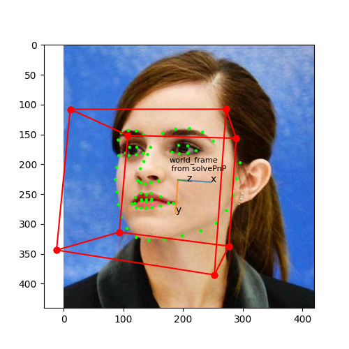

### assignment1 3D to 2D Projection
<!-- 

    

 -->

  <strong>Projected 3D cube in 2D space</strong>

    

### assignment2 solvePnP and Augmented Reality

    
    
    
    

  <strong>Keypoints, reprojected keypoints and augmented reality</strong>

    
    
    
    

### assignment3 Homography

    
    

  

  <strong>Homography transformation and image stitching</strong>

    
    
    
    
    

  <em>Left to right: painting, monet, direct projection, inverse projection, image stitching</em>

 

### assignment4 Epipolar Geometry and Triangulation

    

  <em>Epipolar lines</em>

  

    

  <em>Epipole</em>

  

    

  <em>Triangulated 3D points</em>

