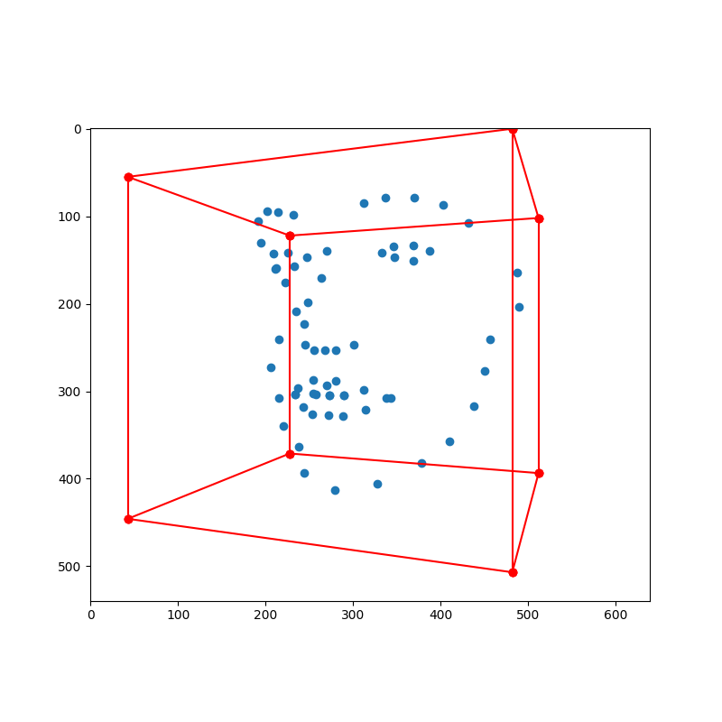
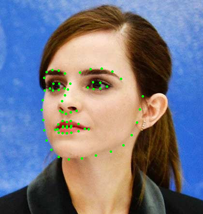
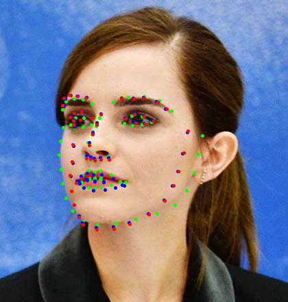
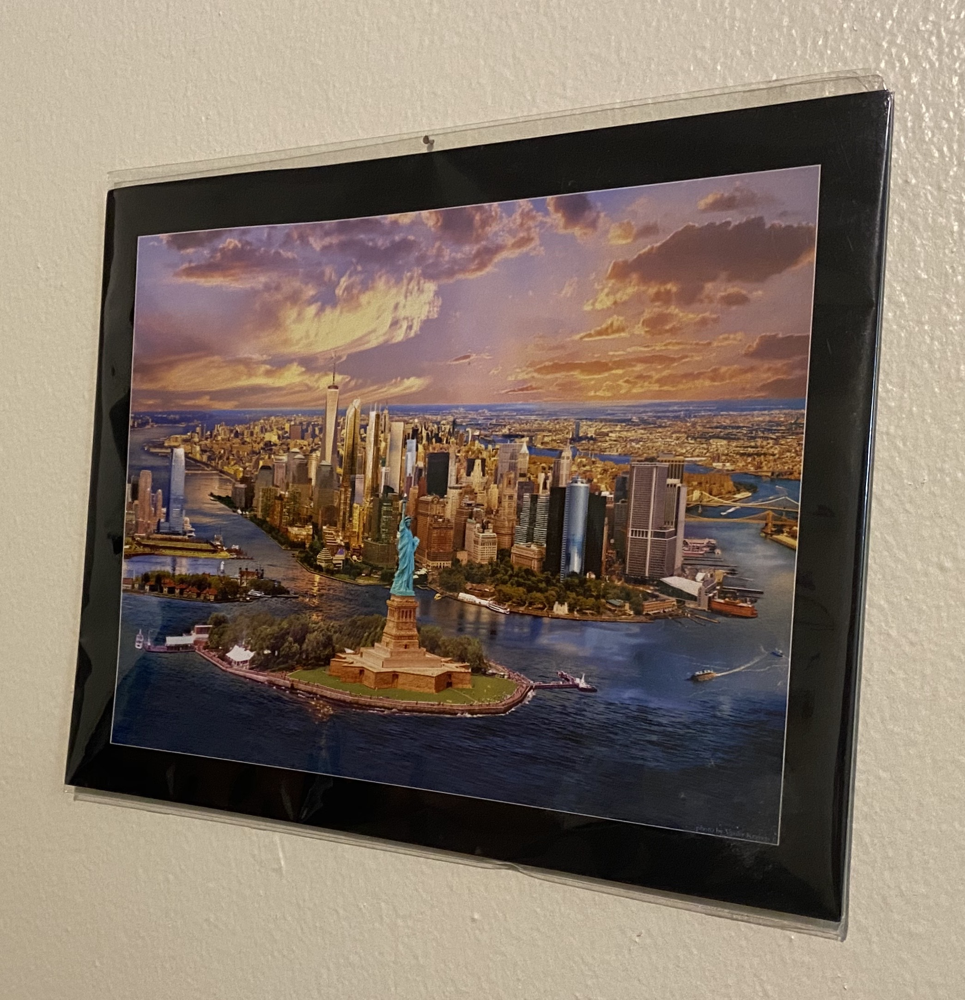
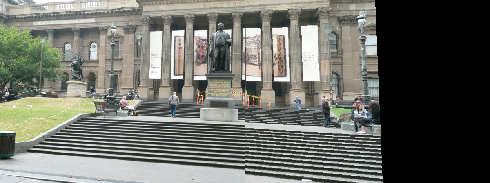
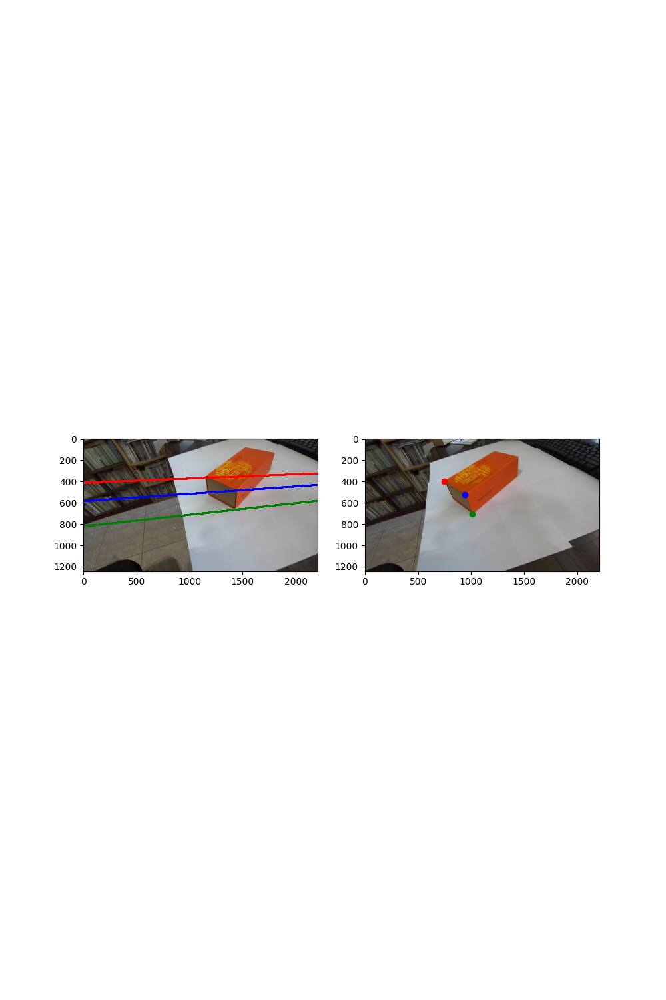
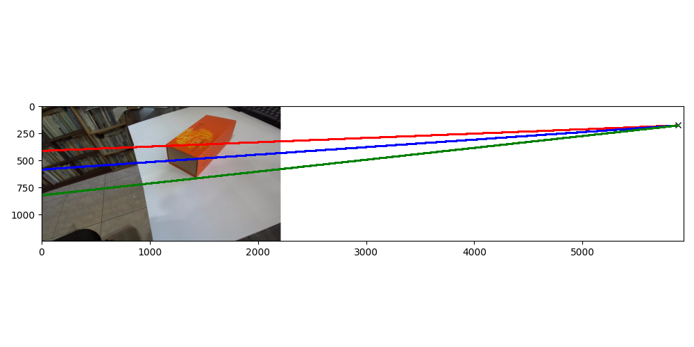
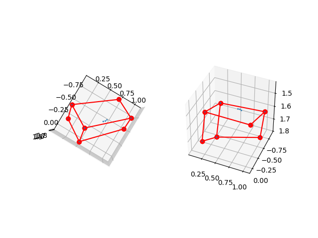

### assignment1 3D to 2D Projection

    

### assignment2 PnP

    
    
    

### assignment3 Homography

    
    

  

    
    <figcaption>Direct projection</figcaption> 

    
    <figcaption>Inverse projection</figcaption> 

  

    
    <figcaption>Image stitching</figcaption>

### assignment4 Epipolar Geometry

    
    <figcaption>Epipolar lines</figcaption>

  

    
    <figcaption>Epipole</figcaption>

  

    
    <figcaption>Triangulated 3D points</figcaption>

